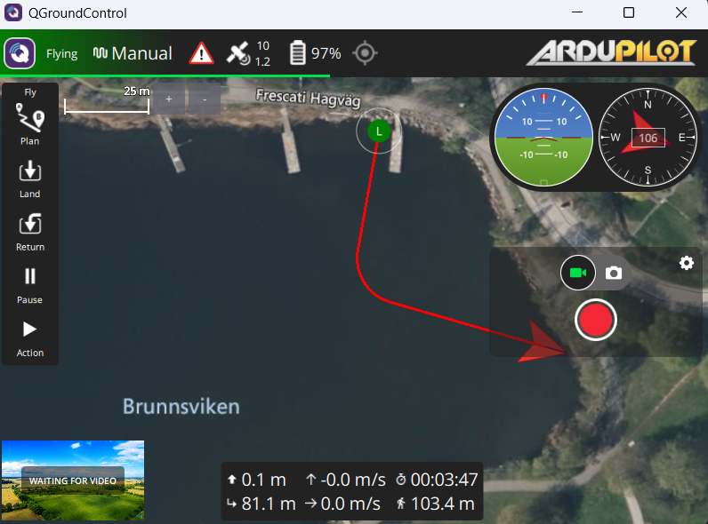

## Running the code

**Table of contents**
- [In Unity simulation](#in-unity-simulation)
  - [Checklist](#checklist)
  - [Commands](#commands)
- [On real vehicles](#on-real-vehicles)
  - [Checklist](#checklist-1)
  - [Switch between GPS and UKF for control input](#switch-between-gps-and-ukf-for-control-input)
  - [Commands](#commands-1)
  - [GPS-denied deployment](#gps-denied-deployment)
- [Remote monitoring](#remote-monitoring)

### In Unity simulation

#### Checklist

Under `formation_controller/config/overall_params.yaml`:
- `use_sim_time` is set to `True`
- `formation_shape_broadcaster/leader_frame`: `leader1/base_link_gt`
- `tf_repub_gps/child_frame`: `NS/base_link_gt`
- `ukf_filter/parent_frame`: `leader1/base_link_gt`

Under `formation_controller/launch/follower_bringup.launch.py`, at the end of the file:
- `gps_heading_to_tf`, `leader_gps_heading_to_tf`, `gps_path` are commented out. You will be using tf data from the simulation, hence the `_gt` suffix. `gps_path` is also already published from the simulation.

#### Commands

```bash
# 1st terminal
ros2 run ros_tcp_endpoint default_server_endpoint --ros-args -p ROS_IP:=127.0.0.1 -p ROS_PORT:=10000

# 2nd terminal (optional)
ros2 launch foxglove_bridge foxglove_bridge_launch.xml

# 3rd terminal (optional, not recommended to run at the same time as foxglove because both processes are heavy)
ros2 bag record -a 

# 4th terminal (you can add as many followers as you want, just change the ns)
ros2 launch formation_controller sam_follower_bringup.launch.py ns:=follower use_ukf:=True

# 5th terminal
ros2 launch tuper_btcpp tuper_bringup.launch.py
```

### On real vehicles

#### Checklist

You should be using `tmux` and the commands should be run in a container as set up in [Installation](installation.md) tutorial.

Under `formation_controller/config/overall_params.yaml`:
- `use_sim_time` is set to `False`
- `formation_shape_broadcaster/leader_frame`: `leader1/base_link_gps`
- `tf_repub_gps/child_frame`: `NS/base_link_gps`
- `ukf_filter/parent_frame`: `leader1/base_link_gps`

Under `formation_controller/launch/follower_bringup.launch.py`, at the end of the file:
- `gps_heading_to_tf`, `leader_gps_heading_to_tf`, `gps_path` are not commented.

#### Switch between GPS and UKF for control input

You can switch between GPS and UKF for control input by changing the following parameters in the files:
- `formation_controller/config/pid_params.yaml`: change between `gps` and `ukf` (should be at least two places)
- `tuper_btcpp/behavior_trees/follower.xml`: change between `gps` and `ukf` (should be only one place at the start)

In addition, when you launch `follower_bringup.launch.py` or `sam_follower_bringup.launch.py` (in sim), you need to also set `use_ukf` to `True` or `False` to use UKF or GPS for control input (see below).

#### Commands

**On every rover/ardupilot vehicle:**
```bash
# Must run on local terminal, not in the container. You can change the master and add more outputs if you want.
mavproxy.py --master=/dev/serial0 --out udp:172.17.0.1:14550
```

On leader 1 (the supreme leader):
```bash
# 1st terminal
ros2 launch arduagent rover_bringup.launch.py ns:=leader1 is_leader:=True

# 2nd terminal
ros2 launch tuper_btcpp leader_bringup.launch.py ns:=leader1 tree_name:=TestRover
```

On leader 2, run the code that can control it to be parallel to leader 1. As of now, the project does not support control for leader 2 yet.

On follower:
```bash
# 1st terminal
ros2 launch arduagent rover_bringup.launch.py ns:=follower is_leader:=False

# 2nd terminal
ros2 launch formation_controller follower_bringup.launch.py ns:=follower use_ukf:=False rosbag:=True
```

#### GPS-denied deployment

By default, the system still collects GPS data to compute ground truth, plot GPS and UKF paths, etc.. However, if you foresee that you will not have GPS at all, you can launch `follower_bringup.launch.py` with `have_gps:=False` to disable all nodes requiring GPS data to avoid dealing with unnecessary warnings.

### Remote monitoring

When deploying real vehicles, you can still monitor the locations of the vehicles and their paths if they are all connected to the same mqtt broker. This repo has set it up by default for you:>

Download [foxglove](https://foxglove.dev/), open new connection, choose `Foxglove Websocket` and open the [GUI default](tuper_foxglove.json) file.

On you local computer, run:
```bash
# 1st terminal
ros2 launch foxglove_bridge foxglove_bridge_launch.xml

# 2nd terminal
ros2 launch monitoring live_monitoring.launch.py rosbag:=True
```

### One follower, one ghost leader

In the case that you only have one boat ready to go as a follower, you can set up an imaginary leader running in ArduPilot SITL.

First, follow the official [ArduPilot SITL](https://ardupilot.org/dev/docs/building-setup-linux.html#building-setup-linux) instructions to set up the simulation, and install [QGroundControl](https://docs.qgroundcontrol.com/master/en/qgc-user-guide/getting_started/download_and_install.html). It is recommended that you do this locally (Linux or WSL2) and not in container, because there is some traffic connection issue between the sim and QGC. Pay attention to these two commands:

```bash
./waf configure --board sitl
./waf rover
```

Add Brunsviken to the list of default locations:
```bash
echo "Brun=59.360074,18.053890,0,190" >> ardupilot/Tools/autotest/locations.txt
```

Add the following lines to `~/.bashrc`, modifying the `ARDUPILOT_ROOT` if you have to:

```bash
ARDUPILOT_ROOT="/home/smarc2user/ardupilot"
export PATH="$PATH:$HOME/.local/bin"
source $ARDUPILOT_ROOT/Tools/completion/completion.bash
```

Run the simulator as a leader locally, not in container (you should be able to run this from anywhere if you have set up the `~/.bashrc` correctly):

```bash
sim_vehicle.py -v Rover --out udp:172.17.0.1:14550 --out udp:localhost:14550 -L Brun
```

Open QGC and you should see the boat show up. Run the default leader path:

```bash
ros2 launch arduagent rover_bringup.launch.py ns:=leader1 is_leader:=True
ros2 launch tuper_btcpp leader_bringup.launch.py ns:=leader1 tree_name:=TestRover
```

You should be able to see something like this (assuming the BT is still as is). You can modify the trajectory in the [leader.xml](../tuper_btcpp/behavior_trees/leader.xml) under the subtree `TestRover`. The leader will be running in the simulation, and the follower will be running in the container. You can also run the follower in the simulation if you want to test it out.

```bash


